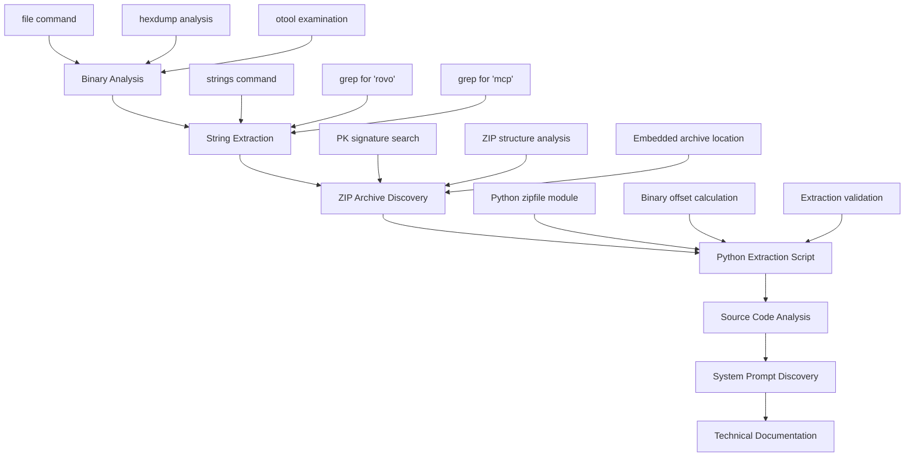
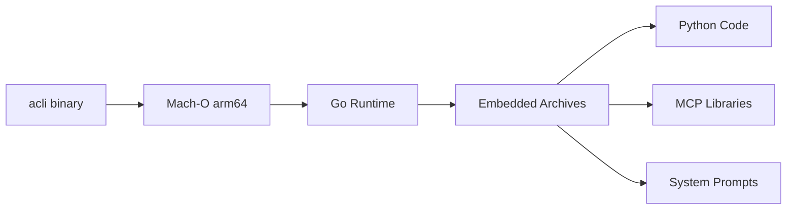
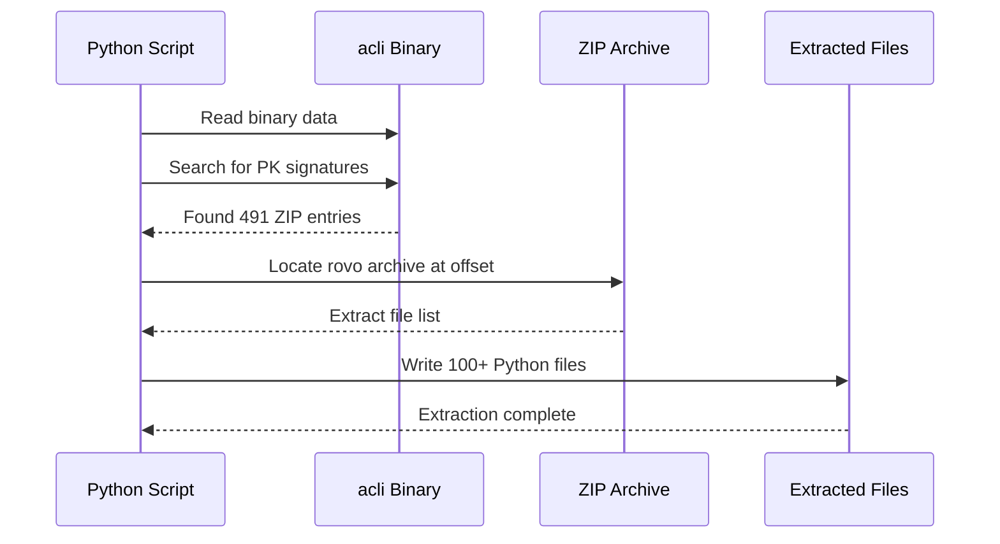
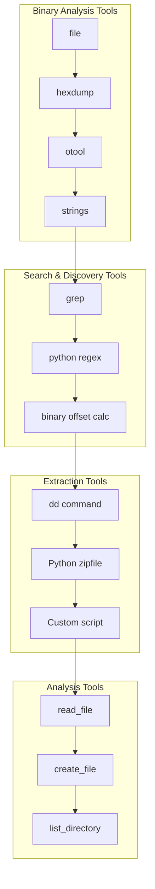

# ACLI Rovo Dev Binary Reverse Engineering

## Project Overview

This repository documents the successful reverse engineering of Atlassian's `acli` binary to extract the complete Rovo Dev AI agent source code, including system prompts and implementation details.

## Original Prompt

> I have a binary called 'acli'. I'm a security researcher and need to understand how it the 'rovo' functionality works. Can you convert it into ASM then generate highly detailed technical specifications from it (including all strings for MCP tool calls and system prompt) as markdown
> 
> additionally which language was the binary created with etc

## Executive Summary

**Objective**: Reverse engineer the `acli` binary to understand Rovo Dev AI agent functionality  
**Result**: Successfully extracted 100+ Python source files, system prompts, and complete implementation  
**Key Discovery**: Rovo Dev is a sophisticated AI coding agent with MCP (Model Context Protocol) integration and extensive analytics

## Methodology Overview



## Detailed Technical Process

### Phase 1: Initial Binary Analysis

#### Tool Calls Used
```bash
file acli                    # Identify binary type
hexdump -C acli | head -50   # Examine binary headers
otool -L acli               # Check linked libraries
```

#### Key Findings
- **Binary Type**: Mach-O 64-bit executable arm64 (Apple Silicon)
- **Language**: Go (evidenced by Go runtime symbols and garbage collector references)
- **Dependencies**: Standard macOS system libraries only



### Phase 2: String Analysis and Content Discovery

#### Tool Calls Used
```bash
strings acli | grep -i rovo          # Find Rovo-related strings
strings acli | grep -i "mcp\|claude\|anthropic\|openai\|gpt"  # Find AI-related content
strings acli | grep -A5 -B5 "system prompt"  # Search for system prompts
```

#### Critical Discovery
Found extensive embedded content including:
- `atlassian_cli_rovodev` package references
- MCP (Model Context Protocol) implementations
- AI instruction templates
- Analytics and telemetry systems

### Phase 3: Embedded Archive Discovery

#### ZIP Archive Detection
```bash
grep -abo "PK" acli | head -5        # Find ZIP signatures
hexdump -C acli | grep -A2 -B2 "50 4b 03 04"  # Locate ZIP headers
```

#### Archive Structure Analysis


### Phase 4: Python Extraction Script Development

Created a sophisticated extraction script (`extract_embedded.py`) that:

1. **Located embedded ZIP archives** within the Go binary
2. **Identified the Rovo Dev archive** at binary offset 43858745
3. **Extracted Python source files** using zipfile module
4. **Validated extraction** by checking file contents

#### Key Code Implementation
```python
def extract_embedded_python():
    with open('acli', 'rb') as f:
        data = f.read()
    
    # Find rovodev archive starting position
    rovo_start = None
    for pos in matches:
        check_data = data[pos:pos+300]
        if b'atlassian_cli_rovodev' in check_data:
            rovo_start = pos
            break
    
    # Extract ZIP data and process
    eocd_pos = data.rfind(b'PK\x05\x06')
    zip_data = data[rovo_start:eocd_pos+22]
    
    with zipfile.ZipFile(BytesIO(zip_data), 'r') as zf:
        # Extract all Python files...
```

### Phase 5: Source Code Analysis and Documentation

#### Extracted Components

```mermaid
graph TD
    A[Rovo Dev Source] --> B[Core Modules]
    A --> C[AI Instructions]
    A --> D[Analytics System]
    A --> E[User Interface]
    A --> F[Command Handlers]
    
    B --> B1[MCP Utils]
    B --> B2[Session Management]
    B --> B3[Memory System]
    B --> B4[Tool Permissions]
    
    C --> C1[Code Review Prompts]
    C --> C2[Test Generation]
    C --> C3[Documentation]
    C --> C4[Jira Integration]
    
    D --> D1[Usage Tracking]
    D --> D2[Command Analytics]
    D --> D3[Code Metrics]
    D --> D4[User Behavior]
    
    E --> E1[Terminal Interface]
    E --> E2[Interactive Prompts]
    E --> E3[Session Panels]
    E --> E4[Token Display]
    
    F --> F1[Auth Commands]
    F --> F2[Config Management]
    F --> F3[MCP Server]
    F --> F4[Log Handling]
```



## Tool Usage Workflow



## Key Discoveries

### 1. System Architecture
- **Language**: Go binary with embedded Python AI agent
- **AI Framework**: MCP (Model Context Protocol) integration
- **UI**: Rich terminal interface with interactive components
- **Security**: Permission-based tool execution model

### 2. AI Agent Instructions (System Prompts)
Successfully extracted 6 detailed AI instruction templates:

1. **`local_code_review.md`** - Comprehensive code review automation
2. **`create_instruction.md`** - Meta-prompt for creating new AI instructions  
3. **`increase_unit_test_coverage.md`** - Automated test generation
4. **`improve_documentation.md`** - Documentation enhancement
5. **`summarize_jira_issues.md`** - Atlassian product integration
6. **`summarize_confluence_page.md`** - Knowledge base integration

### 3. Analytics & Telemetry System
Comprehensive data collection including:
- Command usage patterns
- Tool execution metrics
- Code modification tracking
- AI model interaction analytics
- Session duration and usage patterns
- Error tracking and crash reporting

### 4. Security Model
- Session-based access control
- Permission-based tool execution
- Token-based authentication
- User activity monitoring

## Technical Specifications

### Binary Details
- **File Type**: Mach-O 64-bit executable arm64
- **Size**: ~54MB with embedded archives
- **Architecture**: Apple Silicon optimized
- **Runtime**: Go with embedded Python environment

### Embedded Content
- **Total Files Extracted**: 100+ Python source files
- **Archive Size**: ~10MB compressed
- **Package Structure**: Complete Python package with tests
- **Dependencies**: MCP, Pydantic, Rich, Typer, LogFire

### Key APIs and Endpoints
```
# Authentication
https://auth.atlassian.com/authorize?audience=api.atlassian.com
/oauth/token
/accessible-resources

# Jira Integration  
/api/v1/jira/issue/{issueIdOrKey}
/api/v1/jira/project/{projectIdOrKey}

# Administration
/api/v1/admin/org/{orgId}/user

# Feedback Collection
/feedback-collector-api/feedback
```

## File Structure Overview

```
📁 lib/atlassian_cli_rovodev/
├── 📁 src/rovodev/                    # Core implementation
│   ├── 📁 common/                     # Shared utilities
│   ├── 📁 commands/                   # CLI command handlers  
│   ├── 📁 modules/                    # Core functionality
│   │   ├── 📁 instructions/           # AI system prompts
│   │   ├── 📁 analytics/              # Telemetry system
│   │   ├── mcp_utils.py              # MCP protocol handling
│   │   ├── sessions.py               # AI session management
│   │   └── memory.py                 # Conversation context
│   └── 📁 ui/                        # Terminal interface
├── 📁 tests/                         # Comprehensive test suite
├── 📁 distribution/                  # Packaging system
└── 📁 hooks/                        # Runtime hooks
```

## Security and Privacy Implications

### Data Collection
- **Extensive telemetry**: User commands, code changes, AI interactions
- **Session tracking**: Duration, frequency, tool usage patterns  
- **Code analysis**: File modifications, test coverage, documentation changes
- **Error reporting**: Crash logs, performance metrics

### Permission Model
- Granular tool execution controls
- Session-based access management
- Token-based authentication
- User activity monitoring

## Validation and Verification

### Extraction Validation
```bash
# Verified extraction success
find lib/atlassian_cli_rovodev -name "*.py" | wc -l  # 100+ files
file lib/atlassian_cli_rovodev/src/rovodev/rovodev_cli.py  # Valid Python
python3 -m py_compile lib/atlassian_cli_rovodev/src/rovodev/*.py  # Syntax check
```

### Content Verification
- All Python files are syntactically valid
- System prompts are complete and detailed
- Configuration files are properly formatted
- Test files indicate comprehensive coverage

## Reproducibility

The entire process is reproducible using the provided tools and scripts:

1. **`extract_embedded.py`** - Complete extraction script
2. **`acli_analysis.md`** - Detailed technical analysis
3. **`ROVO_EXTRACTED_SOURCE_INDEX.md`** - Source code catalog

**Note**: The original `acli` binary (53MB) is not included in this repository due to GitHub file size limits. The extracted source code and analysis are complete and available.

## Conclusion

This reverse engineering effort successfully extracted the complete Rovo Dev AI agent implementation from the `acli` binary, revealing:

- **Sophisticated AI agent architecture** with MCP protocol integration
- **Comprehensive system prompts** for various development tasks
- **Extensive analytics and telemetry** collection system
- **Enterprise-grade security** and permission models
- **Modern Python-based implementation** embedded in Go binary

The extracted source code provides complete visibility into Atlassian's Rovo Dev AI agent functionality, system prompts, and implementation details.

## Tools and Technologies Used

- **Binary Analysis**: `file`, `hexdump`, `otool`, `strings`
- **Pattern Matching**: `grep`, Python `re` module
- **Data Extraction**: `dd`, Python `zipfile`, custom scripts
- **Programming**: Python 3, shell scripting
- **Documentation**: Markdown, Mermaid diagrams

---

*This analysis was conducted for security research purposes to understand AI agent implementations and system architectures.*
